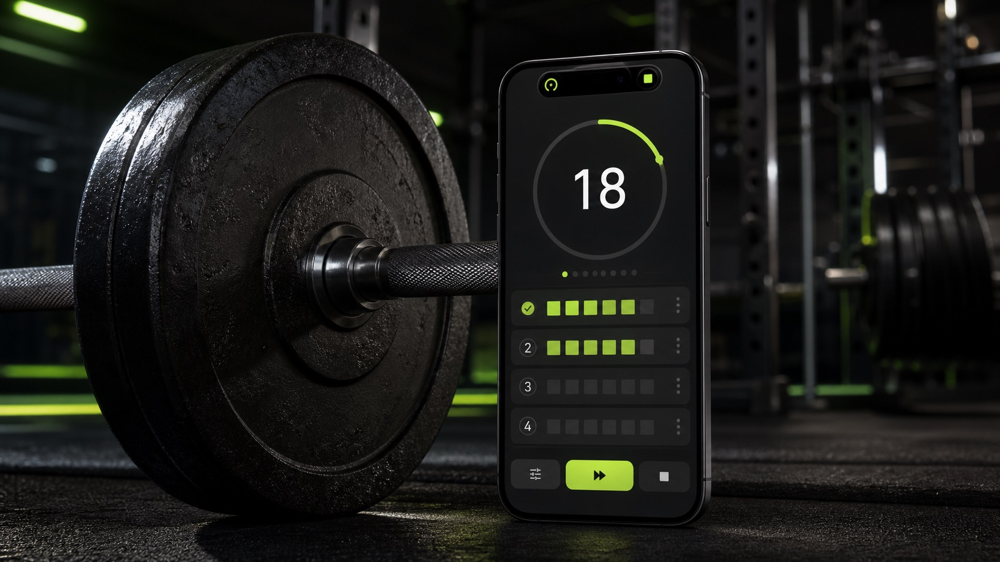

<p align="center">
  
</p>

<h1 align="center">DamSet</h1>

<p align="center">
  <strong>세트는 짧게, 운동 흐름은 끊김 없이.</strong><br>
  루틴부터 세트 기록, 휴식 타이머, 잠금 화면 Live Activity까지 이어지는 iPhone 운동 파트너
</p>

<p align="center">
  
  
  
  
</p>

<p align="center">
  <a href="./docs/user-guide.ko.md">한국어 사용 설명서</a>
  ·
  <a href="./docs/install.md">설치 가이드</a>
  ·
  <a href="./docs/qa-automation.md">QA 가이드</a>
  ·
  <a href="./docs/design-notes.md">디자인 노트</a>
</p>

> [!NOTE]
> DamSet은 현재 직접 빌드해 사용하는 MVP입니다. iPhone 전용이며 배포 대상은 iOS 26.0 이상입니다.

## 왜 DamSet인가요?

운동 중에는 앱을 오래 보고 싶지 않습니다. DamSet은 루틴을 고른 뒤 **횟수 조정 → 세트 완료 → 휴식 → 다음 세트**를 짧은 동작으로 이어 주고, 휴대폰을 잠가도 Live Activity에서 진행 상태를 확인할 수 있도록 만들었습니다.

| 루틴 준비 | 운동 진행 | 잠금 화면 | 기록 확인 |
| --- | --- | --- | --- |
| 운동별 무게·횟수·휴식 설정 | 실제 횟수와 무게를 바로 수정 | Live Activity로 세트와 타이머 확인 | 날짜별 운동 이력과 세트 기록 저장 |
| 오늘 할 운동만 골라 시작 | 세트 추가, 휴식 건너뛰기 지원 | 휴식 종료 3·2·1 알림 | 볼륨과 운동별 변화 확인 |

## 실제 사용 흐름

기본 `Push Foundation` 루틴으로 운동하면 다음과 같이 동작합니다.

```text
Push Foundation 선택
  └─ 오늘 할 운동 선택: Bench Press, Shoulder Press
      └─ Bench Press · 60 kg × 8회
          └─ 실제 횟수/무게 조정 → Set Done
              └─ 90초 휴식 · 잠금 화면 Live Activity
                  └─ 3 · 2 · 1 알림 → 다음 세트
                      └─ 운동 종료 → History에 저장
```

1. **루틴 선택** — `Routines`에서 기본 루틴을 고르거나 `+`로 새 루틴을 만듭니다.
2. **오늘 운동 구성** — `Start Workout`을 누르고 오늘 할 운동만 켠 뒤 세트 수를 확인합니다. 저장된 원본 루틴은 바뀌지 않습니다.
3. **세트 진행** — 실제 횟수와 무게를 조정하고 `Set Done`을 누릅니다. 현재 세트를 한 번 더 하고 싶다면 상단 `+`를 사용합니다.
4. **휴식** — 타이머는 실제 시각을 기준으로 흐르며, 휴대폰을 잠그면 Live Activity에서 남은 시간과 다음 세트 시작 시각을 보여 줍니다.
5. **기록 저장** — 운동을 마치면 완료한 세트만 저장할 수 있습니다. `History`에서 날짜별 기록을 열고 세트 값을 수정하거나 삭제할 수 있습니다.

버튼별 설명, 알림 설정, 잠금 화면 동작과 문제 해결은 [한국어 사용 설명서](./docs/user-guide.ko.md)에 정리되어 있습니다.

## 주요 기능

- 이름·이모지·운동 종목을 포함한 사용자 루틴 생성 및 편집
- 무게, 반복 횟수, 시간 기반 운동, 세트별 휴식 시간 설정
- 운동을 시작하기 전 오늘 수행할 종목만 선택
- 운동 중 실제 횟수와 무게 수정, 현재 세트 반복 추가
- 벽시계 기준 휴식 타이머와 다음 세트 자동 전환
- 잠금 화면 및 Dynamic Island용 Live Activity
- 포그라운드 음성 카운트다운과 잠금 상태 로컬 알림 폴백
- 날짜별 운동 이력, 세트 편집, 총 볼륨 및 운동별 진행 분석
- 진행 중 세션과 완료 기록의 로컬 JSON 저장

## 설치하고 실행하기

### 요구 사항

- macOS와 Xcode 26 이상
- iOS 26.0 이상 iPhone 또는 iPhone Simulator
- Swift 6
- 실기기 설치 시 Apple ID와 Developer Mode

```bash
git clone https://github.com/HSUNEH/damset.git
cd damset
open DamSet.xcodeproj
```

Xcode에서 `DamSet` 스킴과 실행할 iPhone을 선택한 뒤 `⌘R`을 누릅니다. 개인 무료 팀으로도 앱과 Live Activity를 설치할 수 있지만 프로비저닝 프로파일은 주기적으로 갱신해야 합니다. 서명과 실기기 설정은 [설치 가이드](./docs/install.md)를 확인하세요.

## 검증

핵심 상태 머신은 iOS UI와 분리된 Swift 패키지로 테스트합니다.

```bash
swift test
swift run DamSetCoreSmoke

xcodebuild test \
  -project DamSet.xcodeproj \
  -scheme DamSet \
  -destination 'platform=iOS Simulator,name=iPhone 16e'

ruby -e 'require "yaml"; YAML.load_file("seed.yaml"); puts "seed yaml ok"'
git diff --check
```

스모크 실행은 기본 루틴, 횟수·무게 변경, 세트 완료, 휴식 전환, 추가 세트, 기록 요약, 파일 저장 왕복을 한 번에 확인합니다.

## 구조

```text
DamSetApp/             SwiftUI 앱, 루틴·운동·기록 화면
DamSetLiveActivity/    Lock Screen / Dynamic Island 위젯과 App Intent
Sources/DamSetCore/    운동 상태 머신, 모델, 저장소, 진행 분석
Sources/DamSetCoreSmoke/
                       핵심 시나리오 실행 검증
XcodeTests/            XCTest 테스트
docs/                  설치·사용·디자인·QA 문서
```

모든 변경은 `WorkoutSessionSync`의 **저장 → 휴식 알림 동기화 → Live Activity 동기화** 파이프라인을 통과합니다. 앱과 잠금 화면이 같은 세션 상태를 기준으로 움직이도록 실제 횟수와 무게는 하나의 정규 상태에만 보관합니다.

## 알아둘 점

- iOS 정책상 앱이 잠겨 있거나 백그라운드에 있으면 임의의 음성 카운트다운을 재생할 수 없습니다. 이때는 `3`, `2`, `1`, `Next set — go!` 로컬 알림과 시스템 사운드를 사용합니다.
- 포그라운드에서는 음악 볼륨을 잠시 낮추고 음성 `3·2·1`과 종료음을 재생한 뒤 원래 볼륨으로 복귀하도록 구현되어 있습니다.
- 알림 권한, 무음 모드, Focus 설정에 따라 잠금 화면 종료음이 들리지 않을 수 있습니다.
- Apple Watch, iPad, macOS, 소셜 기능과 AI 코칭은 현재 범위에 포함되지 않습니다.

자세한 검증 범위와 아직 실기기 확인이 필요한 항목은 [QA 가이드](./docs/qa-automation.md)에서 확인할 수 있습니다.
